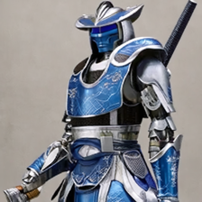
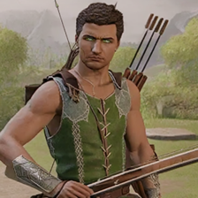
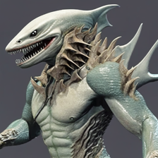

# GenMK

GenMK is an AI system that uses a multimodal model (Phi-4-multimodal-instruct) and a fine-tuned diffusion model (Stable Diffusion XL v1.0, fine-tuned with LoRA, a parameter-efficient fine-tuning technique) to generate images of new Mortal Kombat characters.

To see how it works, see the source code and the `genmk.ipynb` notebook.

To see some examples of new Mortal Kombat characters generated with GenMK, see the images in the `./example_generated_characters` folder. These images are also shown below, along with the prompts used to generate them. 

|  A robotic samurai carrying a silver sword and wearing blue armor. |  An archer wearing a green vest and carrying a brown bow and arrows |  An aquatic-humanoid figure with shark fins and sharp teeth 
|---|---|---|
